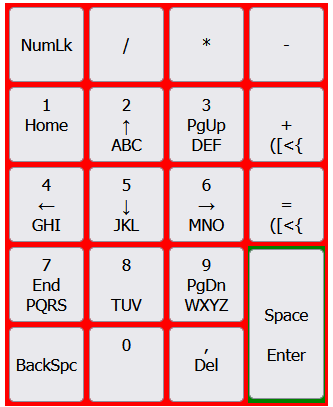

## mikroLaby
Repozytorium do laboratoriów Techniki Mikroprocesorowej

# Prototyp klawiatury numerycznej z trybem klawiatury T9
### inspirowanej metodą wprowadzania tekstu na telefonach z klawiaturą
## w oparciu o płytkę FRDM KL25Z

Kamienie milowe projektu:
- [ ] stworzenie symulatora w HTML/JS
- [ ] zaprojektowanie tymczasowego podłączenia matrycy przycisków do płytki
- [ ] stworzenie oprogramowania dla pytki FRDM KL25Z
- [ ] 
